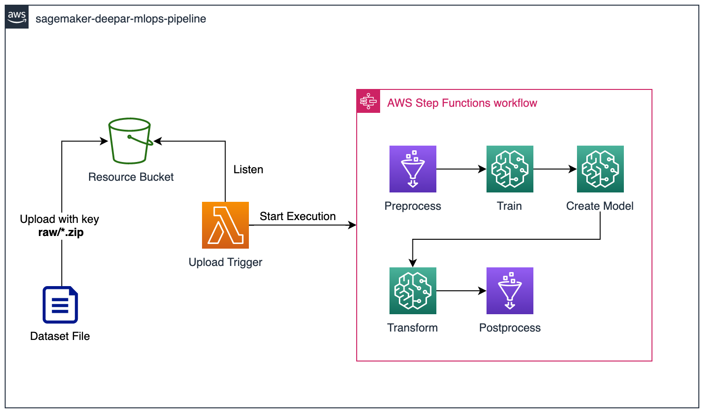
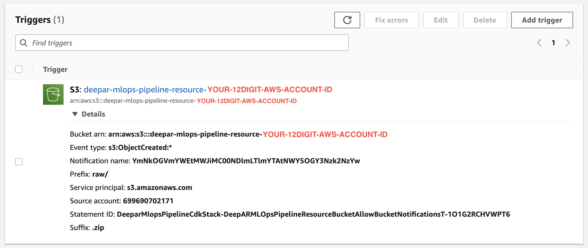
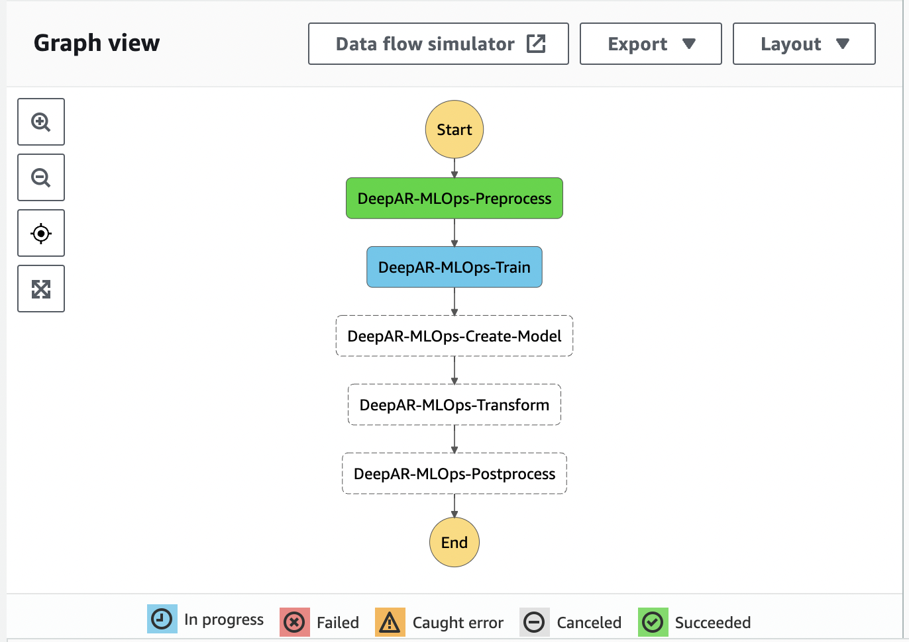

# amazon-sagemaker-deepar-mlops-pipeline-cdk

> This CDK implementation demonstrates how MLOps workflow for __Time Series Forecasting with SageMaker Built-in DeepAR__ can be automated with AWS Serverless Services.

## Prerequisites

AWS CDK v2 is required to deploy this application.
See [this page](https://docs.aws.amazon.com/cdk/v2/guide/work-with.html) to install AWS CDK in TypeScript.  

## Solutions Architecture
> For demonstration, this pipeline has been implemented for an use case for SageMaker Built-in DeepAR from [SageMaker sample notebook](https://github.com/aws/amazon-sagemaker-examples/blob/main/introduction_to_amazon_algorithms/deepar_electricity/DeepAR-Electricity.ipynb). In this example, the user is building a DeepAR model with [UCI Electricity Dataset](https://archive.ics.uci.edu/ml/datasets/ElectricityLoadDiagrams20112014).



This CDK application will deploy a MLOps Pipeline for SageMaker Built-in DeepAR. The pipeline automatically performs preprocessing, model training, model creation, batch transformation, and post processing. This is common process for building a ML model for timeseries forecasting, and the MLOps pipeline created by this CDK application automates it.Each of these operations are implemented and orchestrated with AWS Step Functions.

The pipeline consist of the following steps:

### Preprocess Step
Implemented in Glue Python Job. Performs data operations defined in the python script __glue/preprocess.py__. It downloads the dataset .zip from the resource bucekt, and then process it to train a DeepAR model. The current code contains preprocessing logic for the sample dataset explained above. The script applies same data manipulation defined in the sample notebook. 
For your own dataset, you can implement your own preprocessing script using pandas, NumPy, sklearn, etc. 

### Train Step
Creates a SageMaker Training Job with the dataset files created at the __Preprocess Step__.


Your may have to change training instance type, training hyperparameters and SageMaker DeepAR Image URI denoted in __construct/state-machine.ts__. 

If you want to use different instance type for your training job, please fix it. 

If you are running this pipeline in other region than ap-norteast-2, you have to set SageMaker DeepAR Image URI to a right value, since [SageMaker DeepAR Image URI] can differ. You can find out the list of SageMaker DeepAR Image URIs [here](https://docs.aws.amazon.com/sagemaker/latest/dg/sagemaker-algo-docker-registry-paths.html). 

If you have your own hyperparamert set for your own dataset, please change them as well.

### Create Model Step
Creates a SageMaker Model from the model artifacts (which contains weights, model meta data) created from the __Train Step__.

### Transform Step
Creates a SageMaker Bratch Transformation Job with the trained model to infer future time series. 

If you want to use different instance type for your batch transformation job, please fix it. 

Once __Transform Step__ has been completed, you will find out the inferred values in the resource bucket under __/json/forecast__.

### Postprocess Step
Implemented in Glue Python Job. Performs data operations defined in the python script __glue/postprocess.py__. Since inference results are created in json format by SageMaker Built-in DeepAR, the pipeline will convert to a friendly csv format.
Just like preprocess step, you can add your own postprocessing logic in this step too, using pandas, NumPy, sklearn, etc.

## How to Run
> Note, this part explains how to run the pipeline with [the sample dataset](https://archive.ics.uci.edu/ml/datasets/ElectricityLoadDiagrams20112014) introduced above. 

### Dataset Prepration
You can download the sample dataset by executing the script given in this project like below.
```bash
cd sample-data
python download.py
```

Once done, you will find out __LD2011_2014.txt.zip__ under __sample-data/__ directory.

### Deployment
Run the below command on the root of this project to deploy the pipeline.

```bash
cdk deploy DeeparMlopsPipelineCdkStack
```

If successfully deployed, we are ready to launch 🚀🚀🚀

### Execution
Once you deployed the pipeline, you will find an S3 bucket named `deepar-mlops-pipeline-resource-{YOUR-12DIGIT-AWS-ACCOUNT-ID}`. We will call this bucket __the resource bucket__ from now on. All you have to do now is to upload the dataset file to trigger the pipeline. 

The pipeline execution starts with the Lambda function named `DeepAR-MLOps-Pipeline-Upload-Trigger`. This Lambda function listens to the resource bucket and gets triggered if an object is created under __raw/*.zip__ path.



Now, upload the dataset .zip file to execute this Lambda function and launch the MLOps Pipeline.

```bash
aws s3 cp LD2011_2014.txt.zip s3://deepar-mlops-pipeline-resource-{YOUR-12DIGIT-AWS-ACCOUNT-ID}/raw
```

Navigate to the StepFunctions console to monitor the excecution. You will see the progress like below while execution.



When all the steps are completed, the resource bucket will have the following structure:

```bash
raw/                    # Where you uploaded the raw dataset
json/                   # Where preprocessed json files for SageMaker Built-in DeepAR are stored
model/                  # Where SageMaker model artifacts (weights, model metadata, etc.) generated after training are stored
forecast/               # Where csv files that has future forcast values are stored
```

## Project Structure
This project follows typical AWS CDK project structure. The below directories are important from the user perspective.

```bash
bin/                    # Entrypoint of the entire project
lib/                    # CDK Constructs and Stacks are defined
lambda/                 # Python scripts for Lambda Functions
glue/                   # Python scripts for Glue Jobs
```

## Next Steps
Customize this pipeline by implementing your own preprocessing/postprocessing steps with your own dataset. And don't forget to change the hyperparameters and SageMaker DeepAR Image URIs for your own enviroment!

## 👀 Got Problems?

Please open an issue to let the maintainer know. Or PR would be also appreciated.
The maintainer will reach out!

## Security

See [CONTRIBUTING](CONTRIBUTING.md#security-issue-notifications) for more information.

## License

This library is licensed under the MIT-0 License. See the LICENSE file.